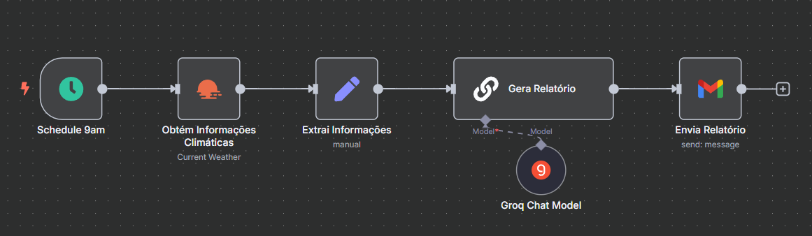

## Alerta Climático
Agendamento diário às 9h para coletar dados meteorológicos de uma cidade, gerar relatório via LLM e enviar por e‑mail ao usuário.

---

## Objetivos

- Disparar automaticamente uma consulta ao OpenWeatherMap.
- Formatar os dados (clima, temperatura, vento) em variáveis.
- Gerar texto explicativo por LLM (Groq + LangChain).
- Enviar relatório por Gmail.

---

## Tecnologias e Serviços Utilizados

- n8n (versão 1.102.4)
- OpenWeatherMap API
- LLM Chain
- Groq Chat Model (`llama-3.1-70b-versatile`)
- API Gmail

---

## Automação

[JSON](alerta-climatico.json)
- **Agendamento diário**: todo dia às 9h o nó Schedule Trigger dispara automaticamente o processo.
- **Coleta de dados**: conecta-se à API do OpenWeatherMap para obter o clima (pt‑BR).
- **Formatação**: com o nó Set (“Edit Fields”), extrai e estrutura em variáveis as informações de clima, temperatura, sensação térmica, umidade e vento.
- **Geração de texto**: o Groq Chat Model (`llama‑3.1‑70b`) e a cadeia LangChain (Basic LLM Chain) recebem esses dados e produzem um pequeno relatório, justificando se é viável realizar eventos ao ar livre.
- **Envio por e‑mail**: por fim, o nó Gmail envia automaticamente ao usuário o texto gerado, no formato de relatório diário.
