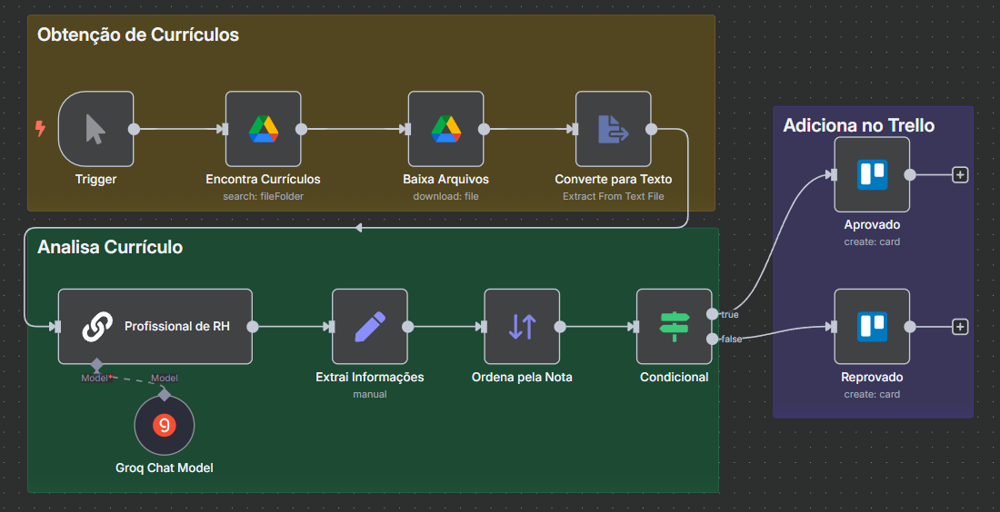

## Assistente de RH
Hoje, os analistas precisam examinar dezenas de currículos para, em seguida, decidir quais candidatos seguem no processo seletivo. Esse trabalho é totalmente manual, consome muito tempo e, muitas vezes, resulta na triagem de perfis cujas competências não correspondem às exigências da vaga.

---

## Objetivos
- Localizar e baixar automaticamente todos os arquivos de currículo recebidos.
- Identificar e padronizar informações‑chave de cada candidato (nome, formação, experiência, habilidades etc.).
- Definir critérios de avaliação e atribuir uma pontuação individual a cada candidato
- Gerar um ranking ordenado dos candidatos com base nas notas atribuídas.
- Listar os candidatos em ordem decrescente de pontuação.
- Criar automaticamente cards em um quadro Trello: aprovados (pontuação ≥ 80) e reprovados (pontuação < 80).

---

## Tecnologias e Serviços Utilizados

- n8n (versão 1.102.4)
- Drive
- LLM Chain
- Groq Chat Model (`llama-3.1-70b-versatile`)
- Trello

---

## Automação

[Workflow JSON](assistente-rh.json)
- O nó **Encontra Currículos** pesquisa no Google Drive todos os arquivos cujo nome contenha “Currículo” dentro de uma pasta específica.
- O nó **Baixa Arquivos** faz o download de cada documento, convertendo arquivos do Google Docs em texto puro.
- **Converte para Texto** extrai o conteúdo textual de cada arquivo baixado.
- O **Basic LLM Chain** (através do modelo **llama3-70b-8192** no nó **Groq Chat Model**) gera uma análise estruturada, incluindo campos como “Nome do candidato:” e “Nota final: X”.
- No nó **Extrai Informações**, expressões regulares capturam:
  - **nome** do candidato
  - **nota** (valor numérico)
  - **análise** completa (texto livre)
- **Ordena pela Nota** ordena os registros pela pontuação em ordem decrescente.
- **Condicional** envia:
  - para o ramo **true** (nota ≥ 80)
  - para o ramo **false** (nota < 80)
- O nó **Aprovado** cria um card na lista de aprovados com nome e análise.
- O nó **Reprovado** cria um card na lista de reprovados com nome e análise.