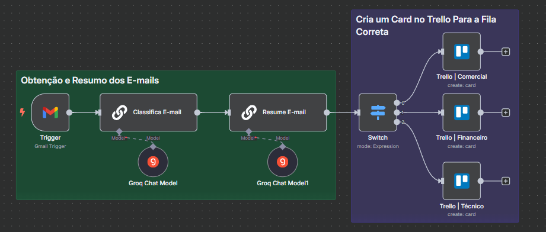

## Distribuidor Inteligente de Suporte
A equipe de suporte recebe diariamente diversos e‑mails em uma caixa única. Hoje, cada mensagem precisa ser lida, resumida e encaminhada manualmente ao time correto (técnico, financeiro ou comercial), gerando card no Trello. Isso consome tempo e está sujeito a erros de roteamento.

---

## Objetivos
- Capturar automaticamente todos os e‑mails recebidos em tempo real (a cada minuto).
- Classificar o assunto de cada e‑mail em uma de três categorias: técnico, financeiro ou comercial.
- Resumir o conteúdo da mensagem para facilitar a leitura pelos responsáveis.
- Criar um card no Trello, na lista apropriada para a categoria identificada.
- Notificar o canal correspondente com o resumo do e‑mail.

---

## Tecnologias e Serviços Utilizados

- n8n (versão 1.102.4)
- OpenWeatherMap API
- LLM Chain
- Groq Chat Model (`llama-3.1-70b-versatile`)
- Gmail
- Trello

---

## Automação

 
[Workflow JSON](distribuidor-suporte.json)
- **Gmail Trigger** dispara a cada minuto ao detectar novo e‑mail.
- **Basic LLM Chain utiliza** o remetente e assunto, e retorna apenas a categoria: `tecnico`, `financeiro` ou `comercial`.
- **Basic LLM Chain** cria um breve resumo com “Quem enviou”, “Título” e “Resumo”.
- **Switch** avalia o campo `text` da classificação e escolhe uma das três saídas (índice 0=comercial, 1=financeiro, 2=técnico).
- Conforme a saída do Switch:
    - **Trello** cria um card na lista “comercial” / “financeiro” / “técnico”, usando o assunto como título e o resumo como descrição.
- Após a criação do card, o canal é notificado pelo Gmail.