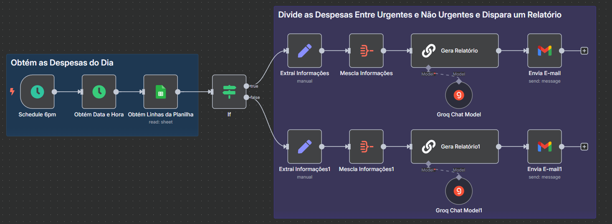

## Fechamento de Caixa
Automatiza, todo dia às 18:30, a coleta de despesas lançadas em um planilha, agrupa-as por valor (>= R$ 1 000 e < R$ 1 000), gera dois tipos de relatório via LLM e envia por e‑mail ao gestor.

---

## Objetivos
- Disparar o processo automaticamente todos os dias às 18:30.
- Capturar a data corrente para filtrar os registros de despesa.
- Ler da planilha apenas as linhas com data igual ao dia atual.
- Avaliar cada despesa e separar em dois grupos:
    - **Valores altos** (≥ R$ 1 000)
    - **Valores baixos** (< R$ 1 000)
- Formatar e agregar as despesas de cada grupo em arrays de strings.
- Gerar **relatório**
- Enviar automaticamente ao gestor, por **Gmail**, o relatório adequado com o assunto “Fechamento de caixa | YYYY‑MM‑DD”.

---

## Tecnologias e Serviços Utilizados

- n8n (versão 1.102.4)
- Date e Time
- Google Sheets
- LLM Chain
- Groq Chat Model (`llama-3.1-70b-versatile`)
- Gmail

---

## Automação

[Workflow JSON](alerta-climatico.json)
- **Agendamento diário** às 18:30 dispara o workflow.
- **Date & Time** extrai a data atual (YYYY‑MM‑DD).
- **Google Sheets** consulta as linhas da planilha do dia atual.
- **If** avalia cada item:
    - **Valor ≥ R$ 1 000** → saída *true*
    - **Valor < R$ 1 000** → saída *false*
- **Ramo Valores Altos (≥ R$ 1 000)**
    1. **Edit Fields** formata cada despesa.
    2. **Aggregate** consolida todas as strings num array.
    3. **Basic LLM Chain** gera um relatório.
    4. **Gmail** envia e‑mail ao gestor com as despesas urgentes.
- **Ramo Valores Baixos (< R$ 1 000)**
    1. **Edit Fields** formata cada despesa.
    2. **Aggregate** consolida as strings num array.
    3. **Basic LLM Chain** gera relatório.
    4. **Gmail**  envia o texto ao gestor despesas não urgentes.