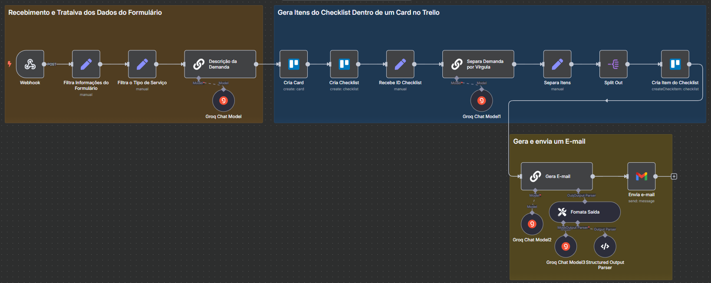

## Gerenciador de Leads
Atualmente, quando um lead preenche o formulário (via Typeform), todo o processo de triagem, criação de card no Trello, geração de checklist de tarefas e envio de e‑mail de boas‑vindas é feito manualmente. Isso gera atrasos e aumenta o risco de esquecer etapas importantes no onboarding.

---

## Objetivos
- Receber automaticamente cada resposta do formulário assim que submetida.
- Extrair dados chave (nome, e‑mail, site, tipo de demanda, descrição).
- Decidir em qual lista do Trello a demanda do lead deve ser criada.
- Criar um card no Trello com título e descrição detalhada do projeto.
- Gerar e anexar automaticamente um checklist de tarefas iniciais.
- Enviar ao lead um e‑mail personalizado de boas‑vindas, com assunto e corpo gerados por IA.

---

## Tecnologias e Serviços Utilizados

- n8n (versão 1.102.4)
- Webhook
- OpenWeatherMap API
- LLM Chain
- Groq Chat Model (`llama-3.1-70b-versatile`)
- API Gmail
- API Trello

---

## Automação

[Workflow JSON](gerenciador-leads.json)
- **Webhook** recebe nova resposta do Typeform.
- **Edit Fields** mapeia `submitted_at` e cada campo do formulário para variáveis legíveis.
- **Edit Fields1** escolhe a lista do Trello com base no “tipo de demanda”.
- **LLM Chain** gera a descrição detalhada do projeto.
- **Trello** cria o card na lista correta, usando “Nome | E‑mail” como título e a descrição gerada.
- **Trello1** inicia um checklist vazio no card e passa o `checklistId`.
- **Basic LLM Chain1** produz as tarefas iniciais (em texto único).
- **Edit Fields2** converte esse texto em array de itens e o **Split Out** faz um loop.
- **Trello2** adiciona cada tarefa como item no checklist do card.
- **Basic LLM Chain2** (com parsers) retorna um JSON com `assunto` e `corpo` do e‑mail.
- **Gmail** envia ao lead um e‑mail de boas‑vindas, usando essas variáveis.